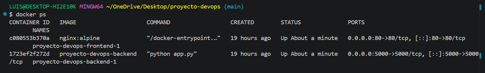

# Proyecto DevOps - ADSO
Sustentación técnica individual para el instructor Efrén Moreno Valoyes.

## Evidencias de Ejecución Local
A continuación se detalla el estado de los contenedores corriendo de forma activa en el entorno local:

